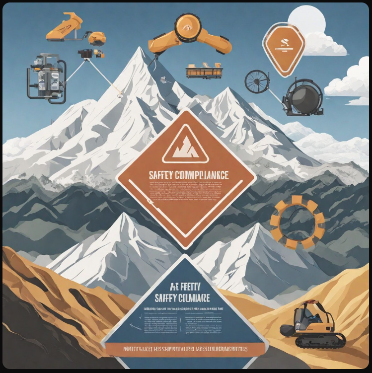

# Safety Engineering Readme

Hey everyone! For me, committing to product safety is like an adrenaline boost. Making lives easier, safer, and better is my ultimate vision. Right now, I'm diving into Model-Based Systems Engineering (MBSE) to build a detailed system database for a machine. Maybe one day I can make a LLM AI with these data. I'll be sharing my progress and interesting links I find along the way. Join me on this exciting journey!

## Table of Contents

1. [MBSE](#1-mbse)
    - [1.1 Definition](#11-definition)
2. [Legislation and Regulatory](#2-legislation-and-regulatory)
    - [2.1 Overview](#21-overview)
    - [2.2 Standard](#22-standard)
    - [2.3 Certification](#.3-certification)
3. [Projects](#3-projects)
    - [2.1 Automatic Welding Tip Changing Machine](#31-automatic-welding-tip-changing-machine)
    - [2.2 Walking Cane](#32-walking-cane)
4. [Appendix](#appendix)
    - [About Mens Feng](#about-mens-feng)
    - [Contact Information](#contact-information)

## 1. MBSE

### 1.1 Definition
Model-based systems engineering (MBSE) is a formalized methodology that is used to support the requirements, design, analysis, verification, and validation associated with the development of complex systems.

AI-For-Beginners
NASA-Progpy

[SysML](https://github.com/Systems-Modeling)Created by OMG supported by IBM, it has been researching in UML, SysML langudges

[PlantUML](https://plantuml.com/en/) This website shows how data can be converted into diagrams, but my question is these insturctions are not human langudge

## 2. Legislation and Regulatory

### 2.1 Overview
The area of medical device engineering is heavily regulated. Practicing systems design engineers must consult and cooperate with regulatory law, attorneys, and other experts. The resources in this guide can help you find legislative and regulatory information from Canada and the United States.

### 2.1.1 Commercial Product vs Industrial Solution
A commercial product is intended for purchase on the market by customers. Before launch, it must undergo a thorough process that includes patent protection, public disclosure, and licensing agreements to ensure viability and compliance with guidelines.
On the other hand, an industrial solution may be developed in-house to support manufacturing processes. For example, a company may design a robot arm for use on a production line to automate tasks. In this scenario, the company faces two options: 
1. **Commercialization**: The company can choose to commercialize the robot arm, selling it to other companies to generate profit. To do so, it must obtain necessary certifications to comply with federal regulations, such as the [Canada Consumer Product Safety Act](https://laws-lois.justice.gc.ca/eng/acts/c-1.68/FullText.html), in the specified region.
2. **In-house Use**: Alternatively, the company may opt to use the robot arm solely within its own facilities to optimize production processes as an improvement solution. In this case, the company must carefully consider safety risks associated with using the arm in-house to prevent harm or danger to human health. Additionally, it must adhere to regulations governing the operation of the robot arm within its facility.

### 2.2 Standard

### 2.3 Certification

## 3. Projects

### 3.1 Automatic Welding Tip Changing Machine

- Leading the development of an automated system that can replace the weld tip on a welding robot, reducing both production cycle time and the need for human intervention

- Adapting industrial communication protocols to better suit the factory environment and ensure safe communication with existing machines through a handshake mechanism

### 3.2 Walking Cane

Successfully designing and crafting a walking cane for the average Canadian, integrating CNC milling and turning operations, and validated the structural integrity through Finite Element Analysis (FEA)

## Appendix

### About Mens Feng

Mens Feng is a seasoned safety engineer with a passion for leveraging technology to improve safety standards. With a background in mechanical engineering and a knack for innovation, Mens Feng has spearheaded numerous projects that have garnered recognition for their impact on safety and efficiency.

### Contact Information

&nbsp;

  [Fork](https://github.com/novatorem/novatorem/blob/main/SetUp.md) this [unlicensed](https://choosealicense.com/licenses/unlicense/) repository to recreate!  
  
  
  

